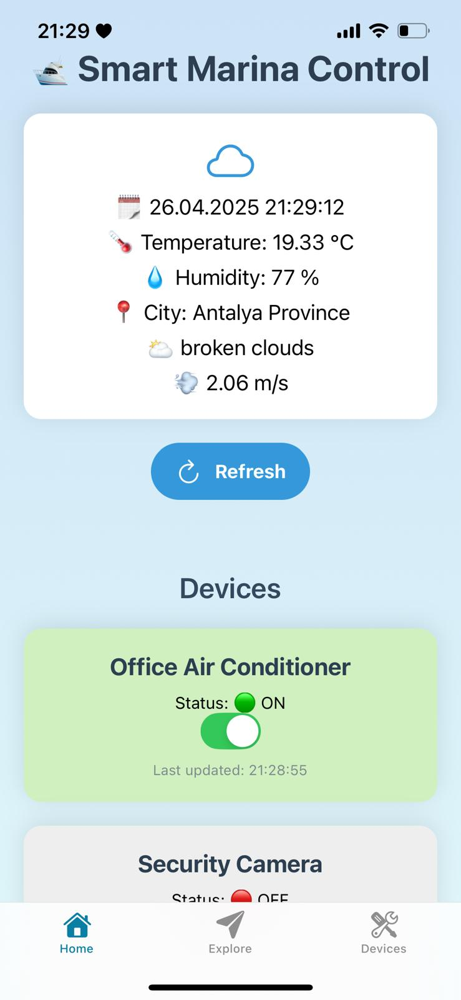
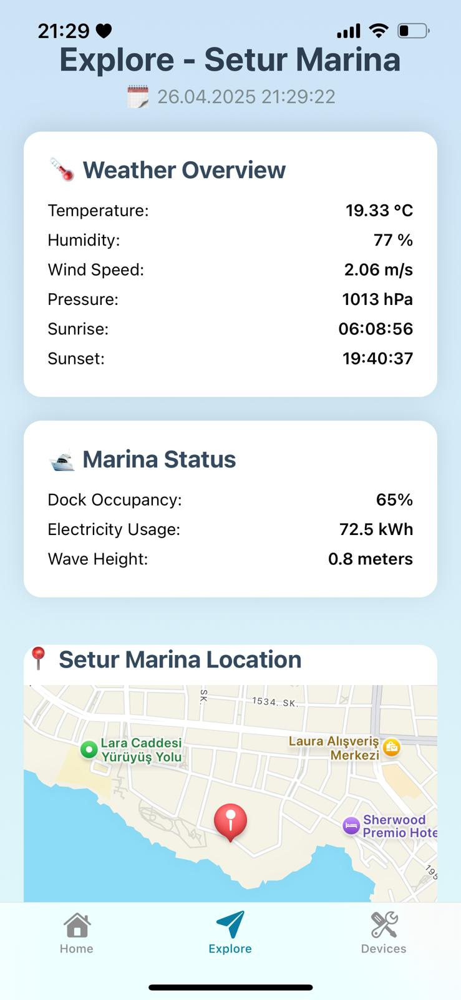
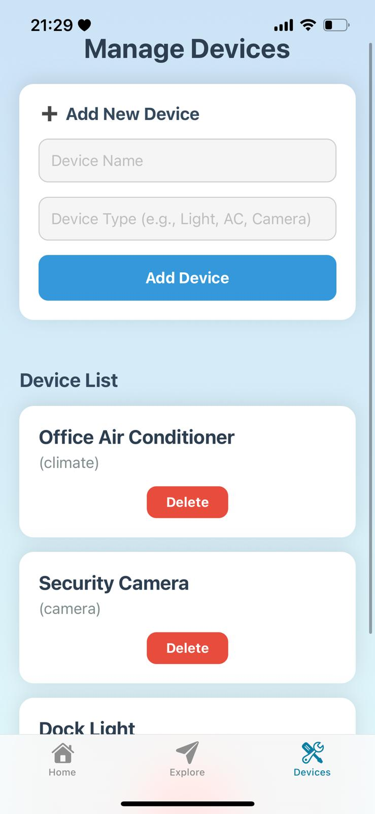

# 🛥 Smart Marina Control - Marina Management and Automation Application

**Smart device management, real-time weather monitoring, and marina automation application for marinas**

---

## 🚀 Project Features

- **Real-Time Device Control:** Turn smart devices on/off, add or delete new devices
- **Real-Time Weather Integration:** Live temperature, wind, pressure, and humidity data for Antalya via OpenWeather API
- **Map and Marina Location:** Setur Marina location displayed on the map
- **Storm Alert System:** Automatic storm alerts triggered by high wind speeds
- **Elegant Animations:** Smooth card transitions with `moti`
- **Push Notification Ready:** Notification permission infrastructure implemented
- **Full Mobile Compatibility:** Easily preview using Expo Go

---

## 🛠 Technologies Used

| Technology                       | Purpose                        |
| --------------------------------- | ------------------------------ |
| **Expo**                         | Mobile development environment |
| **React Native**                 | Main application framework     |
| **Node.js** + **Flask**           | Backend server for device management |
| **Axios**                        | HTTP client for API requests   |
| **Moti / Framer Motion**          | Smooth UI animations           |
| **React Native Maps**             | Map and marker functionality   |
| **Expo Notifications**           | Push notification setup        |
| **React Native Linear Gradient** | Background gradient effects    |

---

## 🌐 Application Sections

### 1. Home

- Displays real-time weather information card
- Continuously updating date and time
- Device control panel with toggles

### 2. Explore

- Detailed weather information
- Storm alert card (appears if wind speed > 12m/s)
- Marina dock occupancy and electricity usage status
- Map showing Setur Marina location

### 3. Devices

- Add new devices (enter name and type)
- Device list view (with name and type)
- Delete devices easily
- Toast notifications after actions

---

## 🔥 Installation and Running

```bash
# Navigate to the project directory
cd SmartMarina

# Install dependencies
npm install

# Start the project (use Expo Go app to scan QR code)
npm start
```

> **Important:**
> This application is currently not supported on web.
> Please scan the QR code generated by `expo start` with Expo Go to launch the app on your device.

---

## 📢 APIs Used

- [OpenWeatherMap API](https://openweathermap.org/api) - Live weather data for Antalya
- Local Flask-based API for device management (add, remove, toggle devices)

---

## 📸 Screenshots

| Home (Main Screen) | Explore (Weather & Map) | Devices (Manage Devices) |
| ------------------ | ----------------------- | ------------------------ |
|  |  |  |

---

## 📄 License

This project is licensed under the **MIT License**.

- ✅ Free for academic and research use
- ✅ Modifications and redistribution allowed
- ❌ Commercial use requires written permission

---

## 📧 Contact Information

**Project Maintainer**  
[]()  
[](mailto:mehmetbarisgudul@gmail.com)  
[](https://www.linkedin.com/in/mehmetbarisgudul/)
